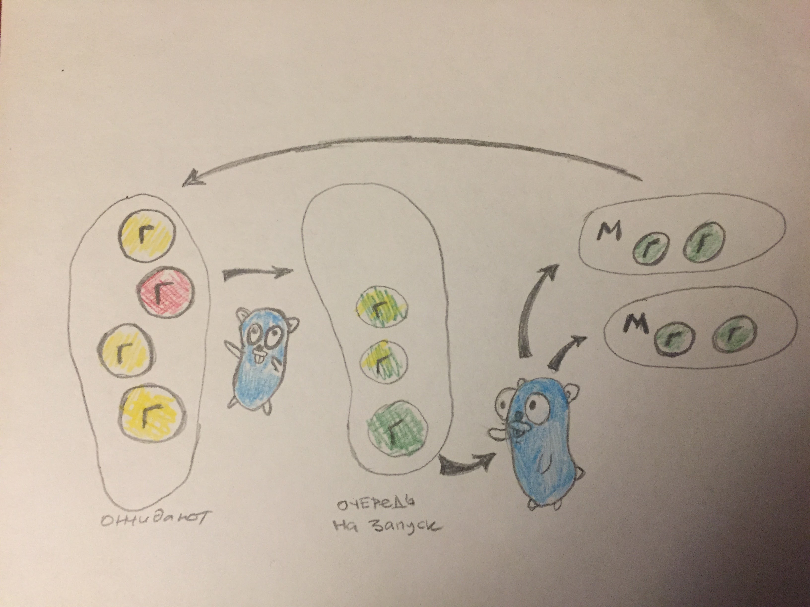

# Горутины

**В этой главе заставим наше приложение скидывать текущую статистику в консоль каждую секунду**

Давайте сделаем так, чтобы приложение каждую секунду выводило в консоль
значение возвращаемое `ds.TotalHits()`. Для этого добавим в файл main.go
функцию `printHits`

---
**Цикл `for {}` это аналог `while (true) {}` в PHP. Вообще в Go всего один цикл `for`**

---

```go
func printHits(ds *ds.Datastore) {
	for {
		time.Sleep(time.Second)
		fmt.Printf("Total visits %v\n", ds.TotalHits())
	}
}
```

Проблема в том, что нам нужно запустить данную функцию одновременно с `http` сервером.
Для этого мы воспользуемся горутиной (goroutine). Горутина — это функция,
выполняющаяся *конкурентно* с другими горутинами в том же адресном пространстве.
Горутины легковесны, вы можете создавать их тысячами.

Для запуска горутины используется ключевое `go`. Изменим функцию `main.go`:

```go
func main() {
	ds := ds.Datastore{}
	go printHits(&ds)
	e := echo.New()
	e.GET("/stat.js", handlers.Stat(&ds))
	e.GET("/counter.js", handlers.Counter(&ds))
	e.Start(":8080")
}
```

Важно что горутины выполняются *конкурентно*, а не параллельно. То есть не надо связывать
выполнение горутины с потоком операционной системы. Горутины управляются
не операционной системой, а самим Go (точнее планировщиком горутин).

Схема работы планировщика и горутин:



Прежде чем идти дальше, давайте решим еще одну проблему которая присутствует в
нашем приложении. Структура `Datastore` не предназначена
для конкурентного использования. Что будет, если одна горутина вызовет `RegisterHit`, одновременно
с другой? В этом случае мы получим ошибку выполнения программы!

---
**Данные по умолчанию не предназначены для конкурентного использования!**

---

Для того чтобы обеспечить синхронизацию данных между несколькими горутинами
можно использоватью мьютексы.

Перепишем наш Datastore с использованием мьютекса из пакета `sync`:

```go
package datastore

import (
	"sync"
)

type Datastore struct {
	hitCounter int
	mu         sync.RWMutex
}

func (ds *Datastore) RegisterHit() {
	ds.mu.Lock()
	defer ds.mu.Unlock()
	ds.hitCounter++
}

func (ds *Datastore) TotalHits() int {
	ds.mu.RLock()
	defer ds.mu.RUnlock()
	return ds.hitCounter
}
```

Через использование мьютекса мы обеспечиваем безопасный доступ к данным со стороны
разных горутин. Однако испольование мьютекса не самый удобный способ, к счастью Go предлагает более удобный инструмент - *каналы*
